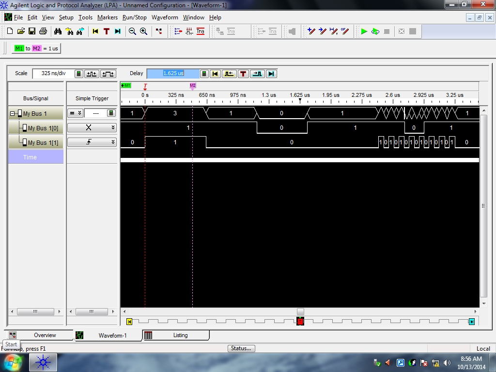
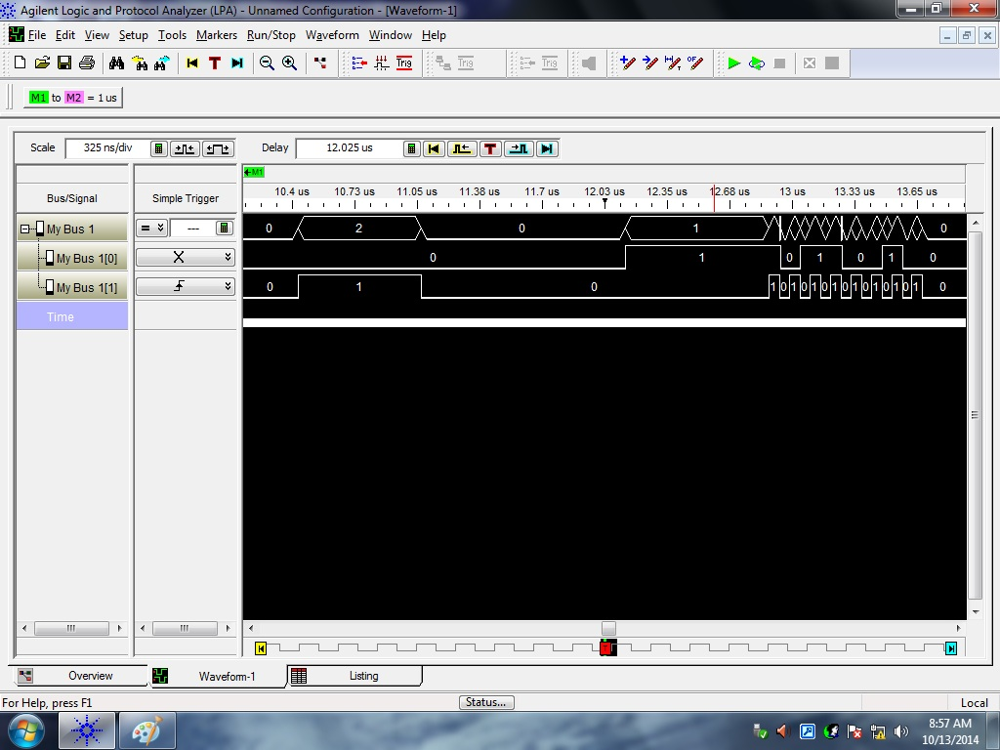
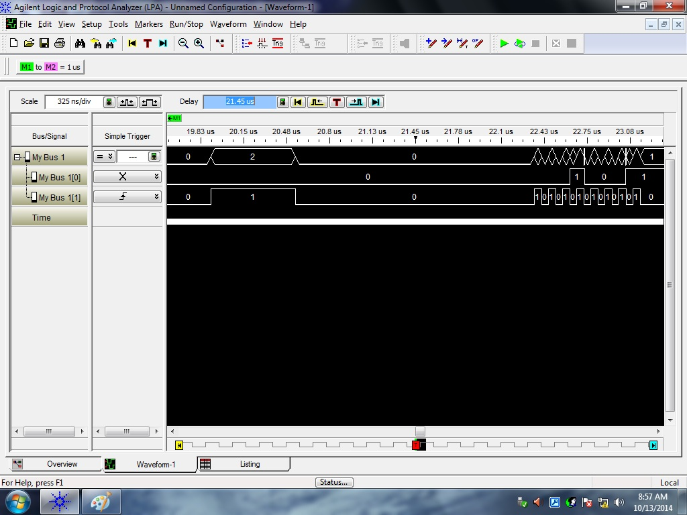
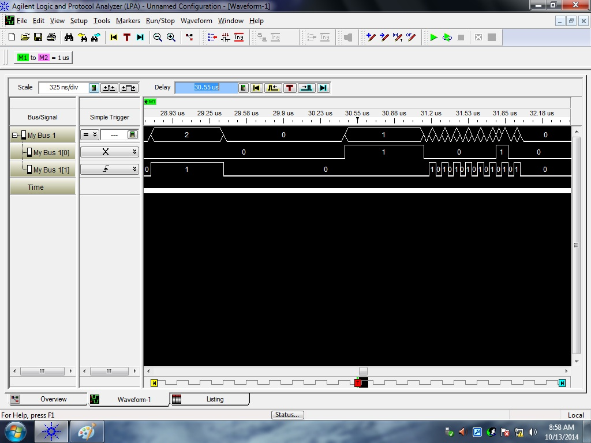
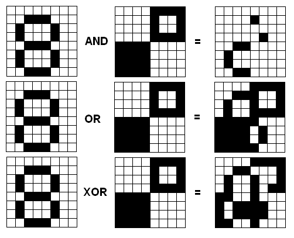

# Lab 3 - SPI - "I/O"

## Logic Analyzer
The answers to the logic analyzer section will be posted to GitHub along with the functionality code.

### Question 1
|Line|R12|R13|Purpose|
|:-:|:-:|:-:|:-:|
|66|NOKIA_DATA|0xE7|Writes a little bar with whole in the middle to the display|
|276|NOKIA_CMD|Row Number|Sets the row|
|288|NOKIA_CMD|Column Number|Sets the column|
|294|NOKIA_CMD|Setup call|"Write a command, setup call to make a copy of the TOS"|

### Question 2
|Line|Command/Data|8-bit packet|
|:-:|:-:|:-:|
|66|Data|11100111|
|276|Command|10110010|
|288|Command|00010001|
|294|Command|00000010|

### Question 2 Waveforms

### Question 3

Dec is a two operand instruction with an immediate source and register direct destination meaning it takes two cycles
and jumps always take two cycles. So, 4 cycles per iteration times 0xFFFF iterations is 262140 in decimal. The clock is running 
1 cycle per microsecond which means that reset is held low for approximately 26 miliseconds. 

### Question 4

## Functionality

A functionality was achieved in the lab. In the interest of saving time and space, it can be assumed that since A functionality
requires drawing an 8 by 8 block that required functionality was also achieved. Below is a video demonstrating A functionality. 

